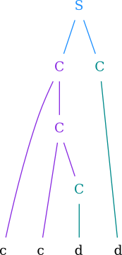
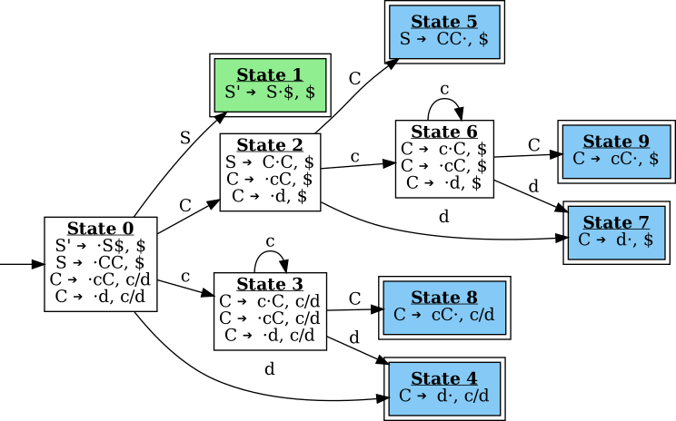

# `yacv`: Yet Another Compiler Visualizer
`yacv` is a tool for visualizing various aspects of typical LL(1) and LR parsers. Check out [demo on YouTube](https://www.youtube.com/watch?v=BozB0O0__Qg) to see sample visualizations


## Introduction

Getting comfortable with parsing can be tough. While the legendary ["Dragon Book"](https://suif.stanford.edu/dragonbook/) is an excellent resource for everything related to compilers, it still contains very minimal visualizations for the parsing process itself. That being said, there exist visualization tools such as [LR(0) parser visualizer](https://www.cs.princeton.edu/courses/archive/spring20/cos320/LR0/) and [LL(1) parser visualizer](https://www.cs.princeton.edu/courses/archive/spring20/cos320/LL1/) by Zak Kincaid and Shaowei Zhu, [JSMachines](http://jsmachines.sourceforge.net/machines/lr1.html), [Jison](https://zaa.ch/jison/try/usf/) etc. However, all of these tools are web-based and most of them show steps in a table which isn't very intuitive

`yacv` attempts to overcome all these shortcomings by using [`manim`](https://github.com/3b1b/manim) 

## Primary features
`yacv` takes in a context free grammar and a string and can be used to :

1. Visualize the syntax tree 
2. Visualize the LR automaton
3. Export the parsing table 
4. Visualize the parsing process step-by-step using [manim](https://github.com/3b1b/manim)

## Working Example

Grammar:

```
S -> C C 
C -> c C 
C -> d 
```

String: `c c d d`

Using the canonical LR(1) parsing method, `yacv` can produce the following:

### Syntax Tree



### LR(1) Automaton



### Canonical LR(1) Parsing Table 

<table>
   <thead>
      <tr>
         <th rowspan="2">STATES</th>
         <th colspan="3">ACTION</th>
         <th colspan="2">GOTO</th>
      </tr>
      <tr>
         <th>$</th>
         <th>c</th>
         <th>d</th>
         <th>S</th>
         <th>C</th>
      </tr>
   </thead>
   <tbody>
      <tr>
         <td>0</td>
         <td>ERR</td>
         <td>['s3']</td>
         <td>['s4']</td>
         <td>['1']</td>
         <td>['2']</td>
      </tr>
      <tr>
         <td>1</td>
         <td>ACC</td>
         <td>ERR</td>
         <td>ERR</td>
         <td>ERR</td>
         <td>ERR</td>
      </tr>
      <tr>
         <td>2</td>
         <td>ERR</td>
         <td>['s6']</td>
         <td>['s7']</td>
         <td>ERR</td>
         <td>['5']</td>
      </tr>
      <tr>
         <td>3</td>
         <td>ERR</td>
         <td>['s3']</td>
         <td>['s4']</td>
         <td>ERR</td>
         <td>['8']</td>
      </tr>
      <tr>
         <td>4</td>
         <td>ERR</td>
         <td>['r3']</td>
         <td>['r3']</td>
         <td>ERR</td>
         <td>ERR</td>
      </tr>
      <tr>
         <td>5</td>
         <td>['r1']</td>
         <td>ERR</td>
         <td>ERR</td>
         <td>ERR</td>
         <td>ERR</td>
      </tr>
      <tr>
         <td>6</td>
         <td>ERR</td>
         <td>['s6']</td>
         <td>['s7']</td>
         <td>ERR</td>
         <td>['9']</td>
      </tr>
      <tr>
         <td>7</td>
         <td>['r3']</td>
         <td>ERR</td>
         <td>ERR</td>
         <td>ERR</td>
         <td>ERR</td>
      </tr>
      <tr>
         <td>8</td>
         <td>ERR</td>
         <td>['r2']</td>
         <td>['r2']</td>
         <td>ERR</td>
         <td>ERR</td>
      </tr>
      <tr>
         <td>9</td>
         <td>['r2']</td>
         <td>ERR</td>
         <td>ERR</td>
         <td>ERR</td>
         <td>ERR</td>
      </tr>
   </tbody>
</table>

### Parsing Video 

<video width="854" height="480" controls>
<source src="vids/lr1-vid-simple-cd-grammar.mp4" type="video/mp4">
Your browser does not support video tag
</video>

